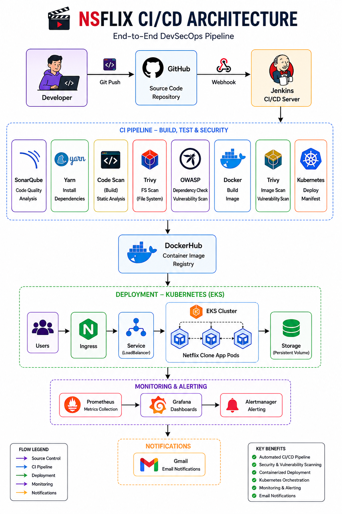
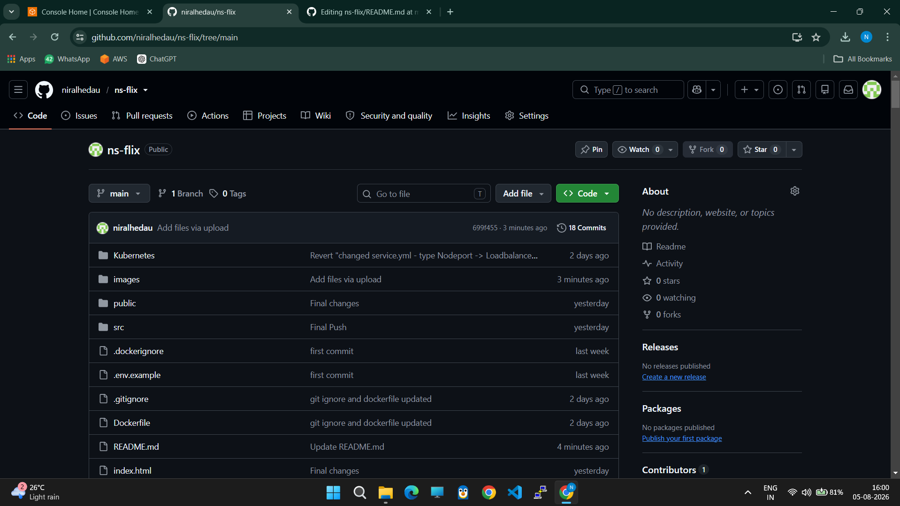
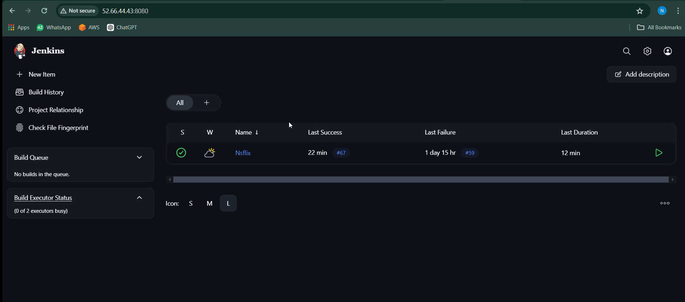
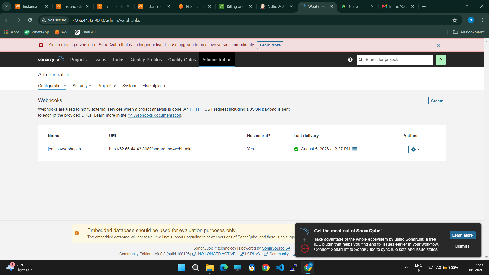
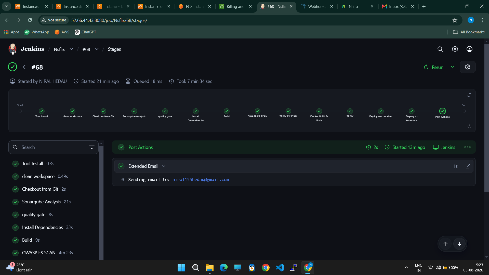
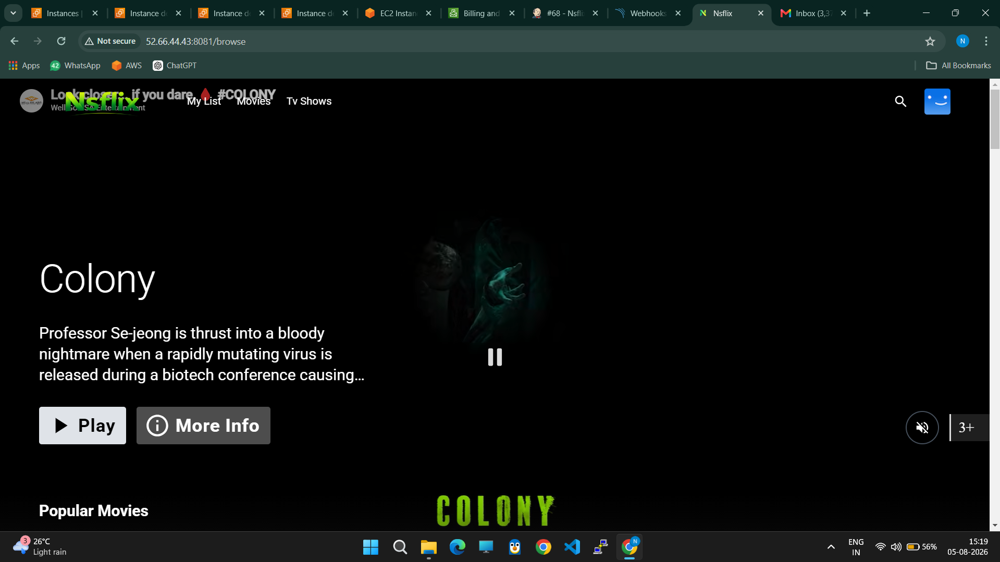
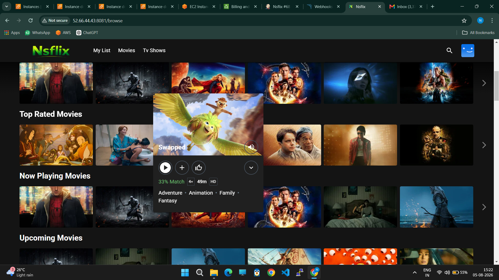
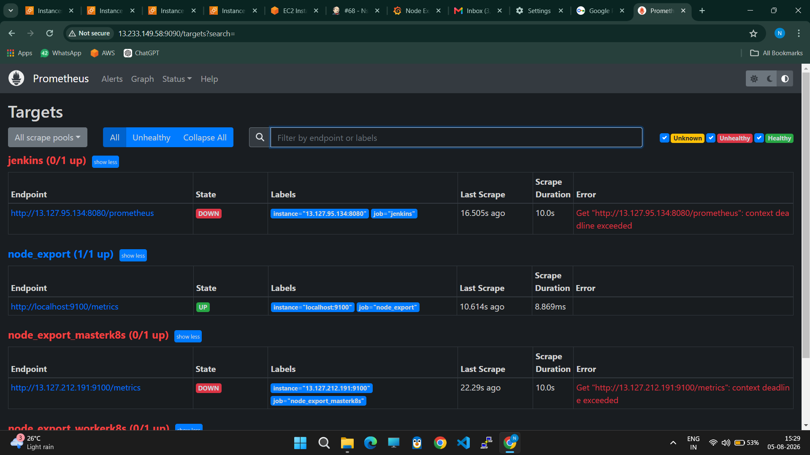
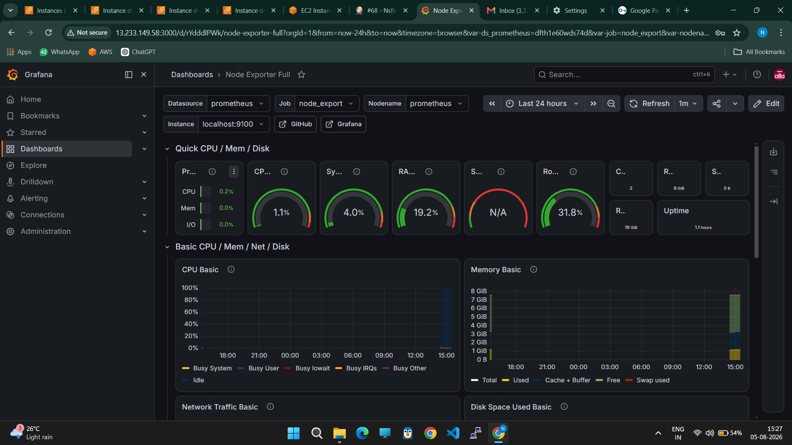

# 🎬 Nsflix (DevSecOps CI/CD Pipeline)


Nsflix is a Netflix-inspired web application deployed using a complete **DevSecOps CI/CD Pipeline**. The project demonstrates automated code integration, security scanning, containerization, Kubernetes deployment, and real-time monitoring using modern DevOps tools.

---

# 📑 Table of Contents

- Project Overview
- Architecture
- Technology Stack
- CI/CD Pipeline
- Project Workflow
- Security Scans
- Monitoring
- Project Screenshots
- Folder Structure
- Future Enhancements
- Author

---

# 🚀 Project Overview

This project demonstrates an end-to-end DevSecOps implementation where every code commit automatically goes through:

- Source Code Management
- Build Automation
- Code Quality Analysis
- Security Scanning
- Docker Image Build
- Image Push to DockerHub
- Kubernetes Deployment
- Continuous Monitoring

---

# 🏗️ Architecture

## Architecture Diagram



---

# 🛠️ Technology Stack

| Category | Technology |
|----------|------------|
| Frontend | React, TypeScript, Material UI |
| Version Control | Git, GitHub |
| CI/CD | Jenkins |
| Code Quality | SonarQube |
| Dependency Scan | OWASP Dependency Check |
| Container Security | Trivy |
| Containerization | Docker |
| Container Registry | DockerHub |
| Orchestration | Kubernetes |
| Monitoring | Prometheus |
| Dashboard | Grafana |
| Cloud | AWS EC2 |
| Web Server | Nginx |

---

# 🔄 CI/CD Pipeline

The Jenkins Pipeline performs the following stages:

```
Developer
     │
     ▼
 GitHub Repository
     │
     ▼
 Jenkins Pipeline
     │
     ├── Checkout Code
     ├── Install Dependencies
     ├── Build Project
     ├── SonarQube Analysis
     ├── OWASP Dependency Check
     ├── Docker Build
     ├── Trivy Image Scan
     ├── DockerHub Push
     └── Kubernetes Deployment
                     │
                     ▼
              Kubernetes Cluster
                     │
                     ▼
              Prometheus + Grafana
```

---

# 📌 Project Workflow


###  Developer pushes code to GitHub



---

###  Jenkins automatically triggers the pipeline



---


###  SonarQube Code Analysis



---

###  Jenkins Pipeline Build



---

###  Nsflix Application



---

###  Movie Details Page



---

###  Prometheus Monitoring



---

###  Grafana Dashboard



---

# 🔐 Security

The project integrates multiple security tools:

- ✅ SonarQube
- ✅ OWASP Dependency Check
- ✅ Trivy Image Scan

These scans help detect:

- Code Smells
- Bugs
- Vulnerabilities
- Secrets
- Vulnerable Dependencies

---

# 📊 Monitoring

Application monitoring is performed using:

- Prometheus
- Grafana

Metrics collected include:

- CPU Usage
- Memory Usage
- Container Status
- Node Metrics
- Kubernetes Metrics

---

# 📂 Folder Structure

```
Nsflix/
│
├── Jenkinsfile
├── Dockerfile
├── deployment.yml
├── service.yml
├── package.json
├── src/
├── public/
├── images/
│   ├── architecture.png
│   ├── homepage.png
│   ├── pipeline.png
│   ├── sonarqube.png
│   ├── trivy.png
│   ├── dockerhub.png
│   ├── kubernetes-pods.png
│   ├── grafana.png
│   └── prometheus.png
└── README.md
```

---

# 🌟 Features

- Netflix-inspired UI
- Responsive Design
- TMDB API Integration
- CI/CD Automation
- Dockerized Application
- Kubernetes Deployment
- Security Scanning
- Monitoring Dashboard

---

# 📈 Future Enhancements

- Blue-Green Deployment
- ArgoCD GitOps
- Helm Charts
- Terraform Infrastructure
- Multi-Environment Deployment
- Slack Notifications
- Email Notifications
- Autoscaling (HPA)
- Kubernetes Ingress
- HTTPS using Cert Manager

---

# 👨‍💻 Author

**Niral Dilip Hedau**

PGCP-ITISS | CDAC, IACSD

DevSecOps | Cloud | Kubernetes | AWS | Docker | Jenkins

---

# ⭐ If you found this project useful, don't forget to Star the repository!
